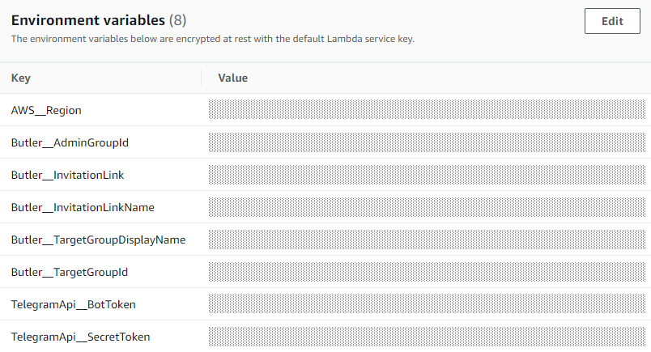

# Butler.Bot Configuration

**Butler.Bot** uses standard [.Net Configuration](https://learn.microsoft.com/en-us/dotnet/core/extensions/configuration) which supports different sources including environment variables and command line arguments.

Default values are written in the file appsettings.json which sits next to bot executable.


## TelegramApi

Section contains parameters required for [Telegram.Bot library](https://github.com/TelegramBots/Telegram.Bot)

```json
  "TelegramApi": {
    "BotToken": "<BOT-TOKEN>",
    "SecretToken": "<SECRET-TOKEN>",
    "SecretTokenValidation": false
  }
```

* **BotToken** (string) - Token provided by [@botfather](https://t.me/botfather) during bot registration.
* **SecretToken** (string) - Token generated during webhook registration via [setWebhook](https://core.telegram.org/bots/api#setwebhook).
* **SecretTokenValidation** (bool) - Flag to switch on / off secret token validation during update processing.

## Butler

Section contains parameters required for **Butler.Bot** workflows

```json
  "Butler": {
    "TargetGroupDisplayName": "<TARGET-GROUP-NAME>",
    "TargetGroupId": -100500100500,
    "AdminGroupId": -100500100500,
    "InvitationLink": "<INVITATION-LINK>",
    "InvitationLinkName": "<INVITATION-LINK-NAME>",
    "MinWoisLength": 120,
    "WhoisReviewMode": "None"
  }
```

* **TargetGroupDisplayName** (string) - Display name of the target group used by the bot in private messages.
* **TargetGroupId** (long) - Telegram id of the target group.
* **AdminGroupId** (long) - Telegram id of admin group. Used only if WhoisReviewMode != None.
* **InvitationLink** (string) - Progenerated invite link used by the bot to invite new members.
* **InvitationLinkName** (string) - Name of the invite link. Bot accept join requests only from this link. All other invite requests are ignored.
* **MinWoisLength** (int) - Minimum length of #whois message. Default = 120.
* **WhoisReviewMode** (string) - "None" (default) / "PpeJoin" / "PostJoin"

## WhoisReviewMode

* **None** - Admin group is not used. No admin messages are sent.

* **PpeJoin** - Every join request is reported to admin group and requires manual admin approval before user is added into target group.

* **PostJoin** - Every new member is reported to admin group after join. Admins have ability to review and remove new member after it.

## Bot Messages

All messages sent by **Butler.Bot** are configurable via appsettings.json.

For example, to override default hello message do the following:

```json
  "Butler": {
      "UserChatMessages": {
        "SayHello":  "This is the new start message"
    }
  }
```

For the list of all messages please see:
* UserChatMessages.cs - for user chat
* TargetGroupMessages.cs - for target group
* AdminGroupMessages.cs - for admin group

## Environment variables

There is an option to define bot configuration using [environment vatiables](https://learn.microsoft.com/en-us/dotnet/core/extensions/configuration-providers#environment-variable-configuration-provider).

For example, config: 
```json
  "TelegramApi": {
    "BotToken": "<BOT-TOKEN>",
    "SecretToken": "<SECRET-TOKEN>"
  }
```
is the same as: 
```
set TelegramApi__BotToken="<BOT-TOKEN>"
set TelegramApi__SecretToken="<SECRET-TOKEN>"
```
It might be used to provide lambda configuration without amending appsettings.json inside the package.


